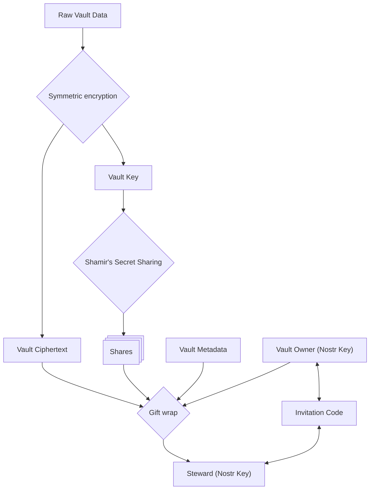

# Executive Summary

This audit's purpose is to verify the security of the Horcrux backup application to validate its defenses against various threats and verify that user data is adequately protected.

This audit was completed on July 23, 2026 and compiled by Matthew Lorentz (primary developer of Horcrux). The audit was performed without the use of AI tools. The timing coincides with the final phases of beta testing before production release of Horcrux 1.0.

The audit revealed one critical security issue (discovered simultaneously during usability testing) that could break the encryption guarantees of the SQLCipher database on iOS devices. This vulnerability could be exploited by an attacker who had already gained access to the Horcrux storage sandbox. Additionally 16 high impact recommendations, 8 medium impact recommendations, and 8 low impact recommendations are listed in context throughout the audit and compiled together in the final _Recommendations and Remediation_ section. None of these further recommendations represent presently exploitable vulnerabilities, but are recommended to deepen defense-in-depth.

# Scope and Methodology

The scope of this audit will include the Horcrux client application at commit `1d737b66` of the repository hosted at https://github.com/mplorentz/horcrux. The audit is divided into phases each focused on a different dimension of the application security.

Phase 1 will start with an enumeration of sensitive assets i.e. user keys, vault data.

Phase 2 will be a modeling of different threat actors and investigation into each of their capabilities and corresponding defenses in the Horcrux system.

Phase 3 will be a white-box tracing of protected asset data flow to verify that proper authorization, encryption, and boundaries between systems are enforced. This will include inspection of the cryptographic core, network protocol, database at rest, and platform surface.

It is also important to note what is excluded from this audit. The external servers the app interacts with like relay servers and push notification servers are user-configurable and will be considered potentially hostile so their code will not be audited. In addition NIP-44 and other standard encryption schemes will be trusted and treated as out-of-scope for this audit. Third party libraries will be reviewed for advisories but not explicitly audited. Horcrux uses asymmetric Nostr keypairs for identity, and this audit will consider the safe handling of user keys and vault data within the app, but will will not address compromise of keys outside of it. Similarly the vault data will only be examined as it is handled within the Horcrux app.

# Detailed Findings

## Phase 1: Assets

Horcrux is a backup tool for arbitrary secrets via the Nostr protocol. The first and most essential asset is therefore the secret the user is backing up, called from here on **raw vault data**. The raw vault data is symmetrically encrypted into **vault ciphertext** and the **vault key** is split into **shares** (in the app called keys) using the Shamir's Secret Sharing algorithm. Shares are exchanged over-the-wire with vault **stewards** in asymmetrically encrypted **gift wraps**. This asymmetric encryption is performed between the the **Nostr keys** of the vault owner and their stewards. Stewards are added to the vault's **steward list** by presenting an **invitation code** given to them by the vault owner. Each stewards must sync a set of **vault metadata** to store with their share in order to participate in recovery operations. The full list of protected assets are therefore:

- raw vault data
- vault ciphertext
- vault key
- shares
- gift wraps
- Nostr private key

* invitation codes

- vault metadata
  - steward list
  - vault name
  - relay list
  - shamir parameters

A map of how these assets relate to one another is illustrated in the diagram below:

## Phase 2: Threat Models

As the nature of the Vault Data is inherently sensitive there are a variety of actors who may wish to compromise the secrets inside. We treat each of their motivations, capabilities, and required protection.

### Malicious Relay

The Nostr relay servers chosen by the vault owner are used to exchange share data and other signals between the vault owner and their stewards.

Because all messages are NIP-59 gift wrapped the relay owner cannot see the contents of the message or the intended recipient's pubkey. However they can see the sender's IP address and the payload size. A malicious relay may also uncover the recipient pubkeys by correlating message timings and building a map of which pubkeys are stewards for a given vault. The relay can also deny availability by refusing to deliver messages.

A malicious relay can also reorder or replay events to requesting clients. Horcrux accounts for these possibilities when processing Nostr events from relays. For instance share data has a monotonically increasing `distribution_version` tag that prevents old share data events from being replayed. Recovery requests and responses will likewise show an error message if they have been processed before.

**Recommendations:**
Horcrux adequately protects vault data but leaks significant metadata to the relay. Recommendations for reducing metadata leakage:

- [HIGH] Integrate IP-anonymizing technology like Tor to mitigate IP leakage.
- [MEDIUM] Add jitter to relay interactions like websocket connections, event requests, and publishing to make timing attacks more difficult.
- [MEDIUM] Pad event content to reduce the relays ability to correlate events (like share data) based on size.
- [HIGH] Switch NIP-59 gift wraps to a form of encryption that provides post-compromise security.
- [MEDIUM] Create more consistent retention expectations for published Nostr events. This could be accomplished by requesting deletion of old share data via NIP-09 and/or setting expiration timestamps on published Nostr events using NIP-40.

### Malicious Steward

A malicious party who is added as a steward to a vault may want to compromise the vault contents without going through the intended social recovery process. A malicious steward represents a steward whose device has been compromised by another actor, or a legitimate steward who has decided to betray the trust of the vault owner. Stewards hold an encrypted share which due to the Shamir's Secret Sharing itself does not provide enough information to decrypt the vault. However they do occupy a privileged position over other actors in that vault metadata is explicitly given to them and they can easily contact the other stewards.

A malicious steward may try to compromise the vault through social engineering or coercion of other stewards. They can initiate a recovery session (or many) with malicious intent, and if they can convince enough of the other stewards to share their shares then they may compromise the vault. This is the core security premise of Horcrux: stewards are expected to be trusted parties acting in accordance with the will of the vault owner, but as a defense the owner can set an appropriate recovery threshold so that even in the case of one or more malicious or compromised stewards the vault cannot be opened.

Defenses against malicious stewards center around education of other stewards on how to spot a legitimate recovery request. Horcrux prompts stewards to contact the vault owner and other stewards before approving a recovery request. It also provides a field for the vault owner to write specific instructions that will be shown to stewards during recovery.

**Recommendations:**

- [HIGH] Better integrate validation of recovery requests into the UI. Plain text instructions are a start but consider a stronger gate where the user is encouraged to leave Horcrux to do validation and mark it as complete before approving any recovery request.
- [MEDIUM] Prompt stewards to notify the vault owner of lost or stolen devices
- [HIGH] Destroy old shares after new ones are stored to reduce attack surface.

### Passive Network Actors

Passive network actors include those with access to the servers and network links between Horcrux users and the relay. This includes Apple's Push Notification Service and Google Firebase Messages for vaults with push notifications enabled. Horcrux uses secure websockets for all relay communication, so the data leaked to network operators is limited to IP source, IP and DNS destination, packet timing, and packet size. Motivations for passive network actors to compromise a specific vault are difficult to find. They could compromise or deny availability if they control the link between two users. A motivated attacker could likely de-anonymize the owner and stewards of a vault, but without compromising or coercing stewards they cannot access the vault content.

**Recommendations**:
Defenses against passive network actors are the same as those for in the Malicious Relay section above.

### Malicious Outsider

What about a malicious outsider who has no special network or social access to the vault or its stewards? This may include targeted attackers or opportunistic parties (ransomware attackers, script kiddies). These actors may want to harm the vault owner explicitly or attempt to profit materially from the sensitive data contained within the vault.

These actors need to gain access to the vault contents stored in memory on the owner's device (if they have not enabled travel mode) or steal enough shares from stewards to clear the threshold and open the vault. Alternatively if they can compromise the Nostr private keys of the owner or a steward they could impersonate the vault owner or a steward to initiate recovery. Traditional methods of this type of compromise include scanning devices for known vulnerabilities or social engineering. Horcrux does encrypt all data at rest so compromising the device disk or app sandbox is not sufficient, keys must be exflitrated from in-process memory while the app is running or from the OS keychain (generally a secure enclave on modern smartphones).

However discovering the correct targets / stewards for a given vault or owner is non-trivial due to Nostr gift wrap encryption. Currently relays serve gift wrapped events to any party so it is not difficult to discover the pubkeys of stewards. But correlation of pubkey to steward is not straightforward especially if users are not re-using Nostr keys across many applications. Against this actor class Horcrux does a respectable job of securing user metadata.

Other defenses against malicious outsiders include the standard protocols of keeping devices up to date, using a secure passcode/biometrics on devices, and staying aware of potential phishing or social engineering attacks. Social engineering defenses include strong instructions for stewards in how to validate recovery requests - see the Malicious Steward section for more details.

**Recommendations:**

- [HIGH] The horcrux relay should only serve events to their intended recipients (use NIP-42 auth gate on requests). This makes the steward pubkeys for a given vault/owner much harder to discover. Horcrux should test third-party relays for this behavior and warn the user if it is not implemented.
- [HIGH] Encourage vault owners and stewards to generate a new key rather than re-using an existing Nostr key during onboarding.
- [HIGH] Horcrux should check devices for passcode/biometric authentication before storing shares.
- [LOW] Horcrux could issue security advisories via push notification encouraging users to update their OS or app if a critical vulnerability is disclosed.
- [LOW] Warn users if their device does not store keys in a secure enclave.

### Malicious Core Developer

The reality of modern software delivery systems means that a malicious core developer of Horcrux or one of its embedded libraries could ship malicious code that exfiltrates vault data to themselves. Modern appstores like the Google Play Store or Apple App Store do not support reproducible builds for open source applications. Motivation for a core Horcrux developer to perform such an attack would need to outweigh the destruction of the product's reputation.

Users' best defense against this is to build the Horcrux app themselves or to install it from a another trusted builder via a third-party app store. Because all source code for Horcrux is made public any third party can ship their own compatible fork.

Another vulnerability is the DNS system. Because Horcrux invitation links use horcruxbackup.com, a malicious developer could perform a man-in-the-middle attack by opening the invitation in Horcrux with attacker controlled parameters that add the steward to a decoy vault. They could then send the invitation acceptance to the owner with their own pubkey as a steward. This could be mitigated by adding stewards via pubkey rather than invitation link, or by the owner and stewards manually verifying each other's pubkeys out of band. Horcrux could also include a verification system to help user's check that they all have the same owner and participant list for a given vault.

- [MEDIUM] Add UX for verifying out-of-band that vaults have the same participant list for all participants.
- [LOW] Set up reproducible builds for Android users.

### Malicious Supply Chain

Horcrux relies on many open-source third-party libraries in addition to the Flutter toolchain and closed-source modern operating system stacks, any layer of which could ship malicious code or vulnerabilities resulting in the exfiltration of vault data. A supply chain attacker may be highly motivated to take whatever secrets they can get once they reach a sufficient install base.

Horcrux can defend against supply chain attackers by reducing reliance on third-party libraries, auditing libraries and their updates and pinning known-good versions. In it's pre-release state Horcrux's formal processes for auditing third-party libraries are lacking and ripe for improvement.

**Recommendations**:

- [LOW] Set up reproducible F-droid builds for Horcrux.
- [HIGH] Audit third party libraries for security vulnerabilities.
- [HIGH] Set up a pipeline to scan for known vulnerabilities in third-party libraries.
- [HIGH] Publish valid app signatures outside the Apple and Google app stores to prevent unauthorized builds from being distributed.
- [LOW] Require git commits to be signed by core developers.

### Advanced Persistent Threat / Nation State Actors

Modern nation states possess the resources to mount much deeper and more sophisticated attacks including discovery and exploitation of zero-day vulnerabilities, legal coercion, and sophisticated surveillance and intelligence capabilities.

These actors may be highly motived to crack vaults containing material subversive to the state or secrets that can be used in blackmail.

Defense against these actors is functionally impossible on modern consumer devices like smartphones. Users with this sort of material must exercise extreme caution using Horcrux and assess its appropriate use in the context of a comprehensive operational security plan involving specially hardened hardware and software.

## Phase 3: Code Audit

In Phases 1 & 2 we enumerated the assets Horcrux endeavors to protect and made several assertions about its methods of protecting said assets. In Phase 3 we take these assertions to the code to verify them. Phase 3 will be divided into sub-sections as follows:

- 3.1 Key material
  - 3.1.1 Handling of Nostr private key
  - 3.1.2 Handling of SQLCipher database key
  - 3.1.3 Handling of Vault Encryption Key
- 3.2 SQLite Database
- 3.3 Raw Vault Data
- 3.4 Vault Shares
- 3.5 Vault Relay List
- 3.6 Steward List
  - 3.6.1 Adding Steward Via Pubkey
  - 3.6.2 Adding Steward Via Invitation Link
  - 3.6.3 Distributing Steward List
  - 3.6.4 Removing a Steward
- 3.7 Nostr Events
- 3.8 Vault Ciphertext
- 3.9 Shamir's Secret Sharing Algorithm
- 3.10 Steward Invitation Code
- 3.11 Push Notification Payloads
- 3.12 Recovery Authorization

### 3.1 Key Material

Horcrux handles several cryptographic keys: the user's Nostr private key, the SQLCipher database encryption key, and a per-vault symmetric encryption key that encrypts the raw vault data and is divided using the Shamir's secret sharing algorithm. We will here trace the handling of each to verify that it is stored securely. Horcrux trusts the operating system to protect the confidentiality of key data while it is stored in memory.

#### 3.1.1 Nostr Private Key

The Nostr private key lives in the `LoginService` class and is either generated securely in `LoginService.generateAndStorePrivateKey()` using the `ndk` library's `Bip340.generatePrivateKey()` function, or passed from a text input field on `LoginScreen` into `LoginService.importNsecKey()` or `LoginService.importHexPrivateKey()`. All three of these `LoginService` functions follow the same pattern: they store the private key in memory in the private `_cachedKeyPair` property and writes it to disk using the `flutter_secure_storage` third party library. `flutter_secure_storage` encrypts the key material and writes it to disk using the appropriate operating system API. On iOS it uses the Keychain API to encrypt it with a key from the device TPM, and on Android it uses the Keystore API which uses TEE or StrongBox hardware if available.

Tracing the usage of `flutter_secure_storage` we can see that it is imported in `db_key.dart`, `secure_storage_corruption.dart`, and `login_service.dart`. In `db_key.dart` the secure storage library is not actually used to read the Nostr private key, but rather to read and write a salt used in HKDF for the SQLCipher encryption key (which is explored further in the _SQLite Database_ section below).

In `secure_storage_corruption.dart` the Nostr private key is never read out of secure storage, the import here is exclusively used to call `deleteAll()` function to clear the secure storage on logout or in the case of corrupted data.

This leaves `login_service.dart` where the storage is read exclusively in the `getStoredNostrKey()` function. This function returns a `KeyPair` containing both the public and private key. Tracing the callers of the `KeyPair.privateKey()` and `KeyPair.privateKeyBech32()` functions we can find three places where the key can leave process memory. One is on the `AccountManagementScreen` where the user is able to copy the key to the clipboard after being shown a warning dialog. A similar copy button exists on the `AccountCreatedScreen` where the user is encouraged to back up their key during account creation. And the third is also through the `AccountCreatedScreen` where the user can choose to use the key as the contents of a new vault (becoming _Raw Vault Data_). All these paths are only reachable through direct user action with appropriate warnings attached.

**Recommendations:**

- [HIGH] Migrate all key handling code into an FFI library with strong memory safety. Dart's garbage collecting memory manager makes it impossible to overwrite key data stored in memory or prevent it from being paged to disk.

#### 3.1.2 SQLCipher Database Key

The SQLCipher database key is used to decrypt pages of the SQLite database Horcrux uses to store application data including Vault Ciphertext, Vault Shares, the Steward List, and more. More on the SQLCipher database setup can be found in the _SQLite Database_ section but here will explicitly trace handling of the key.

The SQLCipher database key is derived at runtime using an HMAC Key Derivation Function (HKDF) which combines the logged in user's private Nostr key with a salt in order to generate a key unique to the user's device. This process is performed in the `DbKeyDerivation` class starting with the `deriveKey()` function. The salt is stored in `FlutterSecureStorage` which uses the Keychain system library on iOS and Keystore system library on Android to take advantage of trusted compute modules when available. The Nostr private key is loaded from `LoginService.getStoredNostrKey()` as examined in the _Nostr Private Key_ section above.

The HKDF extract and expand functions are implemented in `_hkdfSha256()` according to RFC 5869. This code should not be hand-rolled and should use an audited 3rd party implementation. The derived key returned from the HKDF process is encoded to hexadecimal and formatted for use in the `PRAGMA` SQL command and returned to the caller of `DbKeyDerivation.deriveSqlCipherPragmaKey()`. There is exactly one caller of this function: `openSQLCipherConnection()` which is called by `AppDatabase.openDefault()`. The database key is then passed into the SQLCipher library to open the database (as examined in _SQLite Database_) and discarded.

**Recommendations:**

- [HIGH] Horcrux hand-rolls HKDF in `DbKeyDerivation` to derive a SQLCipher encryption key from the user's nsec. Use audited HKDF code from a library instead.

#### 3.1.3 Vault Encryption Key

Each vault's Raw Vault Data is encrypted into Vault Ciphertext with a symmetric key before being distributed to stewards. We call this symmetric key the Vault Encryption Key and here examine it's generation and handling.

The Vault Encryption Key is short lived, generated by an owner's device during the process of distributing shares of the vault data for backup. A new securely random key is generated on each call of `BackupService.generateShamirShares()`. The key is immediately used to encrypt the Raw Vault Data into Vault Ciphertext using the ChaCha20-Poly1305 algorithm provided by the `pointycastle` library. The Vault Encryption Key is then is passed into `SecretScheme.createShares()` where it is divided into shares using _Shamir's Secret Sharing Algorithm_ examined in its own section below. Once encoded into shares the key is discarded from the owner's device.

During the recovery process (see _Recovery Authorization_) a steward may assemble enough shares to open the vault. In this case the Vault Encryption Key is reconstructed by feeding shares into `SecretScheme.combineShares()` in `BackupService.reconstructFromShares()`. Here the Vault Encryption Key is again short-lived, being used in a call to `Aead.decrypt()` to transform the Vault Ciphertext back to Raw Vault Data where it can be viewed and exported by the recovering party, before being discarded again.

### 3.2 SQLite Database

Horcrux stores most application data in fork of SQLite called SQLCipher that symmetrically encrypts the entire database. An audit of SQLCipher itself is out of scope but here we verify that Horcrux initializes and uses SQLCipher properly. All database connections proceed through `AppDatabase` from `app_database.dart` and flow into `connection.dart`'s `openSqlCipherConnection(...)` which contains the only reference to Drift's `DatabaseConnection`. `openSqlCipherConnection(...)` derives an encryption key from the user's private Nostr key (throwing an error if a private key cannot be found) and provides it to SQLCipher via `PRAGMA key = x'bytes'`. However upon inspection of the raw sqlite database on iOS and Android, the iOS build was found to produce a unencrypted SQLite database due to a [known issue with Xcode's automatic linking of standard SQLite before SQLCipher](https://discuss.zetetic.net/t/important-advisory-sqlcipher-with-xcode-8-and-new-sdks/1688).

**Recommendations:**

- [CRITICAL] Ensure that SQLCipher is linked before standard SQLite during iOS builds. Remove dependencies that link standard SQLite as this is not a supported configuration for SQLCipher.
- [HIGH] Implement a runtime check for SQLCipher by checking that `PRAGMA cipher_version` returns a non-null value and refuse to open the database if this check does not pass.

### 3.3 Raw Vault Data

Horcrux takes possession of raw vault data data via `TextEditingController` named `_contentController` on `VaultCreateScreen`. The `_contentController` is passed into the `VaultContentForm` which does read the data to enforce a size limit. Aside from that the only reader is `VaultCreateScreen._saveVault()` which passes the value through the `VaultCotentSaveMixin.saveVault()` function into `VaultRepository.saveOwnedVaultContent()` into `OwnedVaultsCompanion.insert()` which uses Drift to insert or update the `owned_vaults` table in SQLite, which is encrypted using SQLCipher as described above.

The `EditVaultScreen` follows the exact same pattern, and mainly exists to change the title of the screen.

To trace the read paths of the raw vault data from SQLite we start at `OwnedVaultRow` which is read to check ownership of a vault in some cases, and in others to hydrate an `OwnedVaultDetail` object. `OwnedVaultDetail` is used to hydrate the `EditVaultScreen` we treated above, and in `BackupService.createAndDistributeBackup()` where it is ultimately encrypted using the Vault Encryption Key via a call to `Aead.encrypt()` producing the Vault Ciphertext.

In the recovery process `BackupService.reconstructFromShares()` uses the Vault Encryption Key to decrypt the Vault Ciphertext back into Raw Vault Data. It is then passed to `VaultExportServiceProvider.shareVaultContent()` to be shared using a platform-appropriate share interface or to `RecoveredContentScreen` where it can be viewed or copied to the clipboard. Each of these handoffs occur exclusively in response to direct user action: either tapping a button "View Contents" button or "Export as File".

This is consistent with the expectation that Raw Vault Data is never saved to disk unencrypted and is only sent to another process when a user possessing the contents shows explicit intent to share them outside the app.

### 3.4 Vault Shares

Vault shares are the outputs of the Shamir's Secret Sharing algorithm and together are able to reconstitute the secret. It is thus important that they are stored encrypted at rest and only distributed to the proper parties. The Vault owner creates them in `BackupService.createAndDistributeBackup()` where they are passed through a chain of calls eventually being copied into the `content` field of a gift wrapped Nostr event in `NdkService.publishEncryptedEvent()`. Here the shares are asymmetrically encrypted to the pubkey of each vault steward and are no longer decipherable by the owner (except in the case where the owner has included themselves as a steward). These gift wrapped share events are written to the SQLCipher database's `outbox` table and eventually published to the appropriate relays. A trace of the code thus verifies that shares on the owner side are only ever stored unencrypted temporarily in memory.

Stewards then download the gift wrapped share events from the relay servers and the Horcrux app takes possession of them from the underlying `ndk.dart` module in `NdkService._handleIncomingNostrEvent()`. `NdkService.handleIncomingNostrEvent()` unwraps the gift wrap and passes the seal and rumor through the `EventAuthorizer` which checks that the seal matches the rumor and known vault owner pubkey. The share data is then parsed out of the `content` field, which is only read by `Share.init()` and `VaultRepository.addShareToVault()` to write the vault to the SQLCipher database.

Shares are read out of the SQLCipher database into the `VaultDetailRepository` in several functions and instantiated into two classes: `Share` and `VaultDetail`. `VaultDetail` actually does not embed the share data directly but instead embeds a `Share` in each of its two descendent types `OwnedVaultDetail` and `StewardedVaultDetail`. Tracing the usage of `Share` then we see that `payload` is accessed exclusively by `BackupService.reconstructFromShares()` to turn shares back into the Vault Encryption Key which is treated separately.

**Recommendations:**

- [LOW] Refactor `payload` out of `Share` to make vault share data handling easier to reason about. Currently `Share` is used throughout the codebase and therefore the raw vault share is passed around in memory far more than it needs to be. By only loading it from the database when we are ready to decrypt a vault we can reduce the surface area for bugs in the future.

### 3.5 Vault Relay List

A vault's relay list determines which servers are used to relay communication between the vault owner and stewards. Therefore an attacker who can change the relay list can deny availability of the vault shares for backup and recovery.

The vault relay list is stored on the `BackupConfig` type which is stored in the database in the `vault_relays` table. The `BackupConfig` starts life on the `BackupConfigScreen` where the vault owner can change the relays used for a given vault. This is saved to the vault details screen and distributed to stewards (and other owner devices) in the share data Nostr event, which is processed on the steward side into a `Share` and written to the database via `VaultShareService.processVaultShare()` which is only called with events that pass `EventAuthorizer`'s check for the correct owner on the share.

A separate flow exists on the steward side using the invitation link feature. In this case `InvitationService.createReceivedInvitation()` stores the relay URLs included in the invitation link to the `invitation` table which upon acceptance of the invitation are copied into the `relay_configurations` table where they are used for scanning.

We can therefore assert that relays URLs for a vault can only be changed by the owner, or by a steward tapping an invitation link.

Tapping a malicious invitation link could cause Horcrux to mutate the relay list for an existing stored vault, which should be mitigated.

**Recomendations:**

- [HIGH] Tapping an invitation link for a vault we are already a part of should be a no-op
- [HIGH] Guarantee vault invitation link authenticity by signing the URL parameters with the vault owner pubkey or some other authentication scheme.

### 3.6 Vault Steward List

A vault's steward list defines who receives shares, who can initiate push notifications, and who can participate in vault recovery. If an attacker is able to poison the steward list for the owner they could assign themselves enough shares to open the vault. If they can poison it for other steward this opens up new social engineering attacks like fake push notifications or recovery requests. It is therefore important to verify that the steward list is controlled by the owner and its distribution to stewards is secure. While an owner can never claw back a share after it has been distributed, Horcrux does support removing stewards from the steward list, which we will also examine.

#### 3.6.1 Adding Steward Via Pubkey

Similar to the relay list, the list of stewards starts on the `BackupConfigScreen` where the owner generates invitation links or adds stewards directly via their existing Nostr pubkey.

If the steward is added directly via pubkey in `addKeyHolderByPublicKey()` then they are added to the `_stewards` list which is persisted to the `stewards` table by `BackupConfigScreenState._saveBackup()` -> `BackupService.saveBackupConfig()` -> `BackupService.createBackupConfiguration()` -> `VaultRepository.updateBackupConfig()` -> `VaultRepository._persistVault()`. Tracing all paths to write to the stewards `table` we can see that the steward list on the owner side is only mutated by the `BackupConfigScreen` or in the functions examined below in sections _Adding Steward Via Invitation Link_ and _Distributing Steward List_.

#### 3.6.2 Adding Steward Via Invitation Link

When the owner adds a new steward by invitation link their initial record is created in the `stewards` table through `InvitationService._addInvitedKeyHolderToBackupConfig`. This creates the steward with a name but no pubkey. The invitation link contains a code which is stored in the owner's database and is passed directly to the steward. Examination of the invite code security is found in the _Steward Invitation Code_ section. If the code is compromised and redeemed by a malicious party the intended recipients invitation will fail to redeem, prompting the owner to redistribute shares. This may be intuitive but is not made explicit in the UI.

When a steward taps the invitation deep link their copy of Horcrux calls into `InvitationService.redeemInvitation()` which uses the logged in private key to sign an invitation redemption event encrypted to the owner using `InvitationSendingService.sendInvitationAcceptanceEvent()`. The owner's key is set from the invitation link. If the steward tapped a maliciously crafted link from an attacker they could end up subscribing to the attacker's vault, but this would be obvious to the owner as the steward will never show up as having accepted the invitation and the attacker would not gain any special privileges to the real vault.

Back on the owner side the invitation acceptance event lands in `NdkService._handleIncomingNostrEvent()` where it is decrypted, the signature is verified, and the `EventAuthorizor.authorize()` function checks that the invitation code exists in the db, that the vault IDs match, and that the invitation has not already been redeemed. An attacker would therefore need to compromise both the invitation code and the vault id in order to be added to the vault. This is sufficiently difficult without the invitation link (whose confidentiality is assumed) as both values are random and protected from outside observers. Such an attack would also be obvious to the originally intended steward as their invitation would then fail to redeem.

Thus we see that adding a steward via invitation link does not allow modification of the steward list except through the intended channels: either by direct owner action or authenticated redemption of an invitation link by a steward.

**Recommendations:**

- [MEDIUM] Instruct vault owners to share invitation links privately.

#### 3.6.3 Distributing Steward List

Distribution of the steward list is performed by loading the steward list from the SQLCipher database (encrypted at rest) into memory, writing it into a new Share Data Nostr event which is gift wrap encrypted and sent to relays. Stewards (or an owner's other devices) download these events from the relays and write them to their own SQLCipher db. Here we will trace the code to assess the security of this process.

We can see the steward list being read from the database by `BackupService.createAndDistributeBackup()` which is triggered when a vault is saved. This calls `VaultRepository.getBackupConfig()` which synthesizes the `BackupConfig` model containing the steward list from the `vault` and `stewards` tables. Then `createAndDistributeBackup()` continues by converting the stewards to JSON and passing them `generateShamirShares()` which packages them into a `Share` which is passed to `ShareDistributionService.distributeShares()` which calls into `NdkService.publishEncryptedEvent()` which encrypts the appropriate share to the appropriate steward and seals it with the owner's signature. At this point the steward list has been signed, sealed, and encrypted on the owner device without any chance for poisoning by an outside party. The steward once in possession of the event can be sure of its authenticity and integrity.

When the steward (or owner's secondary) device receives such a share event it is processed by `NDKService._handleIncomingNostrEvent()` where it is decrypted, the signature is verified, and the `EventAuthorizer.authorize()` function rejects any share for which we do not already have a vault row in the database with a matching ID and owner pubkey. At this point we know that the steward list contained in the event came from the owner. Further processing is completed in `VaultShareService.processVaultShare()` which does not read the steward list until it calls down to `VaultRepository._persistVault()` which performs the actual write to the `stewards` table. This function performs complex reconciliation of what already exists in the database to dance around the soft-delete (explored in _Removing a Steward_) semantics and a unique index on the vault id and share index. This bookkeeping is important if the user ever needs to restore from an older set of shares, but the logic introduces the possibility of bugs in the future.

**Recommendations**:

- [LOW] Simplify the code in `VaultRepository._persistVault()` that reconciles a new steward list with existing rows in the stewards table.

#### 3.6.4 Removing a Steward

Horcrux provides the ability for a vault owner to remove stewards from an existing vault. Because share data is stored on steward devices it is not possible to guarantee removal of the share data from the steward device. Horcrux follows a best-effort policy by sending a gift-wrapped kind 721 event signaling to the steward that they have been removed. Stewards verify that they have a matching vault owned by the author of the event in `EventAuthorizer.authorize()` and if so the vault is marked archive and all shares for the vault are deleted by `VaultShareService.processKeyHolderRemoval()` which calls down to `VaultRepository.clearSharesForVault()`.

The other stewards of the vault will eventually receive new shares when the `BackupConfigScreen` (the only place where steward removal can be initiated) performs its normal distribution check after a save. These new shares will contain the new steward list and the removed steward will be marked as tombstoned via the `leftAt` column. From this point the removed steward will no longer be authorized to participate in vault recovery (this will be treated in full detail in the _Recovery Authorization_ section).

Therefore a malicious steward with a modified version of Horcrux may hold its shares after being removed. This is consistent with the stated trust boundaries (stewards are trusted to hold a share) and Horcrux takes appropriate measures to prevent removed stewards from gaining access to vault data. Stewards also properly authorize steward removal events, guaranteeing that no attacker can maliciously remove stewards without the owner's private key.

### 3.7 Nostr Events

Horcrux uses Nostr events to pass information between vault owners and their stewards. It is important that this information is encrypted in transit to hide shares and various metadata from third parties. Horcrux uses NIP-59 Gift Wrap encryption that provides encryption of the content, authenticity of the author, and a measure of deniability on the wrapped content. It does not hide the recipient of a given message, which may be discovered via timing attacks. NIP-59 has been separately audited and will not be re-examined here. But we will verify that Horcrux properly uses NIP-59 and the Dart ndk library to gift wrap all the Nostr events it publishes.

Horcrux does not import its own WebSocket implementation but instead accomplishes all communications with relays through the `ndk.dart` package. We can see that the `Ndk` type is only referenced in two files of the Horcrux main target: `ndk_service.dart` and `publish_service.dart`. Auditing `ndk_service.dart` we verify that there are no calls that publish Nostr events to relays, `ndk_service.dart` is focused on configuration and querying and delegates publishing to the `PublishService` in `publishEncryptedEvent()`. In `PublishService` we can see that the only reference to `Ndk` is in `_broadcastToRelay()` which calls `ndk.broadcast.broadcast()` to publish a Nostr event to specific relays.

Tracing all call hierarchies of `PublishService._broadcastToRelay()` we see that it is called by `_processOneRelay()` which is called either directly by `_processQueue()`. `_processQueue()` pulls events out of the `outbox` sqlite table which is only written to by `PublishService.enqueueEvent()`. `PublishService.enqueueEvent()` is exclusively called by `NdkService.publishEncryptedEvent()`. Reading the implementation of `publishEncryptedEvent()` we can see that it unconditionally calls `_buildGiftWrapEvent()` on each event before publishing, which calls down to `Ndk.giftWrap.toGiftWrap()` which performs the NIP-59 seal and encrypted wrap. Thus we can prove that all Nostr events published by Horcrux are encrypted in transit.

### 3.8 Vault Ciphertext

We have already examined that the vault data is encrypted at rest, being written into SQLCipher as vault ciphertext, and only exposed to stewards who have assembled the sufficient shares, we can now verify that this vault ciphertext is encrypted in transit and only exposed at all to those who are intended to have it: namely the vault stewards.

The vault ciphertext comes to be in `BackupService.createAndDistributeBackup()`, and its antecedents have been explored already in the _Raw Vault Data_ section. `BackupService.createAndDistributeBackup()` calls into `BackupService.generateShamirShares()` where it is encrypted with a securely generated Vault Encryption Key via `Aead.encrypt()` from the `pointycastle` library. This produces the vault ciphertext which is stored in the `Share` type which is returned to `createAndDistributeBackup()` which passes them into `ShareDistributionService.distributeShares()`. This function passes the shares to `NdkService.publishEncryptedEvent()` where they are gift wrap encrypted as detailed in the _Nostr Events_ section. These gift wrapped events are downloaded by stewards and decrypted as comprehensively described in the _Vault Shares_ section. As we asserted there, there are no other readers of the ciphertext, and we therefore prove that it is encrypted in transit and only distributed to the appropriate stewards.

### 3.9 Shamir's Secret Sharing Algorithm

Horcrux implements Shamir's Secret Sharing algorithm in the `shamir_gf256.dart` library. The implementation's mathematical correctness is tested using Known Answer Tests and the methods provided in Section 9 of the McGrew Threshold Secret Sharing IETF draft (https://datatracker.ietf.org/doc/html/draft-mcgrew-tss-03).

The correctness is tested in `secret_scheme_test.dart` specifically the `reconstruct secret from spec KAT shares` test, whose values have been verified to match those provided in the McGrew spec.

The spec also gives instructions for testing the share generation correctness by "generating secret values uniformly at random, then applying the Share Generation process to them to generate a set of shares, then applying the Share Reconstruction algorithm to the shares, then finally comparing the reconstructed secret to the original secret. Implementations SHOULD perform this test, using a variety of thresholds and secret lengths." These tests are also implemented appropriately in `secret_scheme_test.dart`'s `round-trip split/combine` test group with 6 combinations of parameters.

We also check that the share generation uses cryptographically secure random number generation provided by Dart math's `Random.secure()` method. The randomness for coefficient and x-coord generation can be traced to to the `SecretScheme.createShares()` function which passes the class instance's `_random()` property. This property is initialized to `Random.secure()` when the default `SecretScheme()` initializer is used, however there exists a second `SecretScheme.withRandom()` initializer that is used for testing with a fixed-seed generator. Examining the production code we can verify that `BackupService` correctly uses the `SecretScheme()` constructor, but stricter guarantees could be set up here to ensure that the insecure generator is never accidentally used in production code.

**Recommendations**

- [MEDIUM] Make the `SecretScheme.withRandom()` constructor unusable in the production target with a runtime assertion or compile-time access modifiers.

### 3.10 Steward Invitation Code

The invitation codes are used to authenticate stewards before they are added to the steward list of a vault. They exist to make the the invitation link system system secure. This system allows owners to easily invite stewards to be part of a vault without multiple round trips of communication. This system as been partially evaluated in _Vault Steward List_ but here we will examine all the code that handles the invitation code, because if an attacker can gain access to a live invitation code or write their own to the owners database they can be added to a vault as a steward incorrectly.

The invitation code is generated on the owner side in response to user action on the `BackupConfigScreen` which delegates to `InvitationService.generateInvitationLink()`. This uses the `generateSecureID()` function to generate a securely random 32 bytes which are used as the invitation code. The invitation code is then written to the `invitations` table in the SQLCipher database along with other steward metadata. This steward row cannot be misinterpreted as a valid steward (and i.e. given shares) because it lacks a pubkey until the code has been redeemed.

The vault owner is then prompted to share the invitation link with the steward out-of-band (it has previously been recommended to emphasize the need for a secure communication channel here).

On the steward side the invitation link comes in through `DeepLinkService.handleIncomingLink()` and the code is parsed out and written to the database's `invitation` table in `InvitationService._saveInvitation()`. The user is shown the `InvitationAcceptanceScreen` and if they choose to accept the invitation to the vault `InvitationService.redeemInvitation()` is called. This function loads the invitation via the code from the `invitation` table and does a few sanity checks before sending a kind 716 invitation acceptance Nostr event back to the owner containing the code and the vault ID.

The owner when receiving a kind 716 invitation acceptance event in `NdkService._handleIncomingNostrEvent()` checks that the code and vault ID in the event match what the owner has saved locally in in their `invitations` table in `EventAuthorizer.authorizeInvitation()`. Finally the `stewards` record is updated with the stewards pubkey, making it a live steward on the vault, in `InvitationService.processInvitationAcceptanceEvent()`.

Invitation invalidation happens on the owner side when removing an invited steward or generating a new invitation link. Invalidation works by setting the `revoked_at` timestamp on the `invitations` table which is checked by `InvitationService.redeemInvitation()` before adding a steward to the steward list.

We therefore see no opportunity for an attacker to add themselves to the steward list via the invitation code system unless they can steal a live invitation code from the owner or a steward.

**Recommendations:**

- [MEDIUM] Automatically expire invitations after a given period of time.
- [LOW] Invitation authorization logic is duplicated between the `EventAuthorizer._authorizeInvitation()` and `InvitationService.redeemInvitation()` functions. Notably the `EventAuthorizer` does not check the `revoked_at` column to detect revoked invitations. Consolidate the logic into the `EventAuthorizer` to reduce surface area for bugs in the future.

### 3.11 Push Notification Payload

Horcrux allows vault owners to opt in to push notifications to notify owners and stewards of various vault events. Especially sensitive are notifications for recovery requests and responses. These notifications use Google's Firebase Cloud Messaging Service, Apple's Push Notification Service, and the horcrux-notifier API. For this audit we treat these push notification servers as hostile. They can refuse to deliver notifications or in extreme circumstances deliver forged notifications. It is Horcrux's job then to authenticate the data coming in through the push notification service.

The architecture of the push notification services in Horcrux are set up to do exactly this, by relying on signed Nostr events in the push notification payload rather than implicitly trusting content coming from the server. It should be noted that there is a parallel `LocalNotificationService` that does not interact directly with the OS level push notifications. This service processes Nostr events from relays while the app is running and shows the user a notification that looks the same as a push notification, but in this case no push service is involved - only the relays the owner has configured. The `PushNotificationReceiver` is the service that receives notification payloads from the Firebase Cloud Messaging library, and that is what we will examine here.

The `PushNotificationReceiver` has three main integration points with Firebase Cloud Messaging: `FirebaseMessaging.onMessage`, `FirebaseMessaging.onMessageOpenedApp`, and `_processLaunchNotificationIfAny()`. The latter two both pass the pushed message to `handleNotificationTap()` giving us two paths to evaluate.

When the push notification server delivers a push notification while the Horcrux app process is running it fires the `FirebaseMessaging.onMessage` callback which the `PushNotificationReceiver` registers in `_subscribeToForegroundMessages()`. In `_onForegroundRemoteMessage()` then the message data is parsed into a Nostr event and passed to the `NdkService.processGiftWrapFromForegroundPush()`. This function is a small shim to initialize the `NdkService` and then immediately pass the contained Nostr event to the `NdkService._handleIncomingNostrEvent()` function that handles every Nostr event that the app receives, (usually from a relay server) and performs the proper authorization and processing based on its kind, which has been explored in its pieces throughout this audit.

When a device running Horcrux receives a push notification while the Horcrux app process is stopped we follow a different path. The OS shows the notification to the user but does not deliver it to the Horcrux process until the app is launched (either by a tap on the notification or some other means). In this case Horcrux receives the notification data from `FirebaseMessaging.onMessageOpenedApp` or `PushNotificationReceiver._processLaunchNotificationIfAny()` both of which delegate processing to `PushNotificationReceiver.handleNotificationTap()`.

In `PushNotificationReceiver._handleNotificationTap()` after deduplication the event is again passed to `NdkService.processGiftWrapFromForegroundPush()` and `NdkService._handleIncomingNostrEvent()`. After this call however the function calls `LocalNotificationService.navigateForKind()` which can show a recovery request approval screen or recovery status screen. This function is called regardless of whether authorization passed on the event in the push notification payload. The navigation will fail if a legitimate recovery session cannot be found in the local database. But even still, `NdkService._handleIncomingNostrEvent()` should probably propagate authorization fails that would allow `PushNotificationReceiver.handleNotificationTapped()` to abort processing of the notification altogether and potentially even show a warning message to the user.

By tracing the handling of push notification taps and payloads we can see that Horcrux does not privilege data from push notification services but uses them as a vehicle for signed Nostr events from appropriate parties, maintaining the trust boundary for recovery integrity.

**Recommendations:**

- [HIGH] Stop processing of pushed Nostr events if they do not pass `EventAuthorizer` checks to avoid the possibility of navigating the user to a vault or (legitimate) recovery request maliciously.

### 3.12 Recovery Authorization

The recovery process is the critical mechanism by which the Raw Vault Data can be viewed by someone other than the owner. It is important that only parties authorized by the owner (a.k.a. stewards) are able to participate in recovery and ultimately decrypt the vault contents after assembling shares equal to or exceeding the threshold set by the owner.

We have already examined the security of many structural elements used for recovery: the creation of a vault with secrets, symmetric encryption of the vault data, adding stewards to the vault, the Shamir's Secret Sharing algorithm, distribution of shares to the stewards, and push notifications for recovery events. With the stage set we can now examine the process by which a recoverer requests shares from their peers and decrypts the vault. Because Shamir's Secret Sharing algorithm gives us strong mathematical guarantees about what is required to open the vault, namely a sufficient number of shares, our primary focus will be tracing how these shares move during recovery which must be only by consent of their stewards.

In Horcrux's UI any steward, or an owner who is self-stewarding their vault, can "Initiate Recovery" from the `VaultDetailButtonStack`. We will call this initiating steward the Recoverer. This sends kind 714 recovery request events from `RecoveryService.initiateAndSendRecovery()`. These requests contain an ID for the recovery session along with other vault metadata. Crucially they are signed (inside the gift wrap seal) by the Recoverer. The Recoverer creates one recovery request event addressed to each steward of the vault that they have in their local database and publishes these to the relays they have associated with the vault in `RecoveryService.sendRecoveryRequestViaNostr()`. The Recoverer also triggers push notifications containing the recovery request event by sending an HTTP request to the configured push notification server.

Every other steward of the vault (we will call them Responders) should then receive the recovery request event via one of two mechanisms: from the push notification (received in `PushNotificationReceiver._handleNotificationTap()` or `PushNotificationReceiver._onForegroundRemoteMessage()`) or via a routine scan by the `NdkService` when the user opens the app. All events are routed to `NdkService._handleIncomingNostrEvent()` where the standard verification of the gift wrap and authorship are performed by `EventAuthorizer` as we have seen elsewhere. Specifically `EventAuthorizer.authorize()`, when it sees the kind 714 recovery request, calls `_authorizeStewardOrOwner()` to verify that the event author matches a known vault steward or owner in the devices local database. The integrity of of this list has already been audited in the _Vault Steward List_ section.

After the initial authorization the request is passed to `RecoveryService.processRecoveryRequest()` where it deduplicated and written to the local database, causing it to show up in Horcrux's own notification UI: `RecoveryRequestBanner`. This banner is shown on most of the screens in Horcrux, and tapping it takes you to a list of pending recovery requests. Tapping through the user is presented with the `RecoveryRequestDetailScreen` which explains to the user that one of their "keys" to the vault is being requested, with buttons to approve or deny the request.

If the request is denied we can follow the code in `_RecoveryRequestDetailScreenState._respondToRequest()` as it calls `RecoveryService.respondToRecoveryRequestWithShare()` with `approved: false`. This calls `RecoveryService.sendRecoveryResponseViaNostr()` which we see construct the recovery response Nostr event and crucially does _not_ include the share data when `approved == false`.

If the request is approved the same code path is followed but with `approved: true`. In this case the Shamir's share and metadata are added to the tags of the recovery response Nostr event (kind 715) and the event is encrypted to the Recoverer's Nostr key and published to the vault's relays.

The Recoverer's Nostr key here is loaded from the SQL database, and it's important to trace that this record is only written in response to an authorized recovery request as we traced above. Doing a search for all references to `initiatorPubkey` we can see that the only write to the `recovery_requests` table is the call to `RecoveryRequestsCompanion.insert()` in `VaultRepository.addRecoveryRequestToVault()` which is only called by `RecoveryService.processRecoveryRequest()` which we examined above and `RecoveryService.initiateRecovery()` in which it writes the stewards own recovery request to disk when they initiate recovery. So there is no code path by which a recovery response could be encrypted and sent to anyone other than the request initiator.

So we see that stewards are only shown recovery requests from other stewards who have been authorized by their owners, and that the responding stewards only send their share back to the legitimate request initiator. The recovery process therefore adequately protects share data from any unauthorized party during recovery.

**Recommendations:**

- [LOW] `RecoveryService.sendRecoveryResponseViaNostr()` uses `Share.shareToNostrTags()` to add the share data to the recovery response event. This functions includes extraneous information like the vault ciphertext, vault name, owner name, etc. Even though this information is transmitted in a secure gift wrap it is unnecessary and can be dropped to reduce attack surface area.

# Recommendations and Remediation

Below is a list of all the recommendations given throughout the earlier phases of the audit, ordered by severity, duplicated here for reference.

- [CRITICAL] Ensure that SQLCipher is linked before standard SQLite during iOS builds. Remove dependencies that link standard SQLite as this is not a supported configuration for SQLCipher.
- [HIGH] Integrate IP-anonymizing technology like Tor to mitigate IP leakage.
- [HIGH] Switch NIP-59 gift wraps to a form of encryption that provides post-compromise security.
- [HIGH] Better integrate validation of recovery requests into the UI. Plain text instructions are a start but consider a stronger gate where the user is encouraged to leave Horcrux to do validation and mark it as complete before approving any recovery request.
- [HIGH] Destroy old shares after new ones are stored to reduce attack surface.
- [HIGH] The horcrux relay should only serve events to their intended recipients (use NIP-42 auth gate on requests). This makes the steward pubkeys for a given vault/owner much harder to discover. Horcrux should test third-party relays for this behavior and warn the user if it is not implemented.
- [HIGH] Encourage vault owners and stewards to generate a new key rather than re-using an existing Nostr key during onboarding.
- [HIGH] Horcrux should check devices for passcode/biometric authentication before storing shares.
- [HIGH] Migrate all key handling code into an FFI library with strong memory safety. Dart's garbage collecting memory manager makes it impossible to overwrite key data stored in memory or prevent it from being paged to disk.
- [HIGH] Audit third party libraries for security vulnerabilities.
- [HIGH] Set up a pipeline to scan for known vulnerabilities in third-party libraries.
- [HIGH] Publish valid app signatures outside the Apple and Google app stores to prevent unauthorized builds from being distributed.
- [HIGH] Horcrux hand-rolls HKDF in `DbKeyDerivation` to derive a SQLCipher encryption key from the user's nsec. Use audited HKDF code from a library instead.
- [HIGH] Implement a runtime check for SQLCipher by checking that `PRAGMA cipher_version` returns a non-null value and refuse to open the database if this check does not pass.
- [HIGH] Tapping an invitation link for a vault we are already a part of should be a no-op
- [HIGH] Guarantee vault invitation link authenticity by signing the URL parameters with the vault owner pubkey or some other authentication scheme.
- [HIGH] Stop processing of pushed Nostr events if they do not pass `EventAuthorizer` checks to avoid the possibility of navigating the user to a vault or (legitimate) recovery request maliciously.
- [MEDIUM] Prompt stewards to notify the vault owner of lost or stolen devices
- [MEDIUM] Create more consistent retention expectations for published Nostr events. This could be accomplished by requesting deletion of old share data via NIP-09 and/or setting expiration timestamps on published Nostr events using NIP-40.
- [MEDIUM] Pad event content to reduce the relays ability to correlate events (like share data) based on size.
- [MEDIUM] Add jitter to relay interactions like websocket connections, event requests, and publishing to make timing attacks more difficult.
- [MEDIUM] Add UX for verifying out-of-band that vaults have the same participant list for all participants.
- [MEDIUM] Instruct vault owners to share invitation links privately.
- [MEDIUM] Make the `SecretScheme.withRandom()` constructor unusable in the production target with a runtime assertion or compile-time access modifiers.
- [MEDIUM] Automatically expire invitations after a given period of time.
- [LOW] Horcrux could issue security advisories via push notification encouraging users to update their OS or app if a critical vulnerability is disclosed.
- [LOW] Warn users if their device does not store keys in a secure enclave.
- [LOW] Set up reproducible builds for Android users.
- [LOW] Require git commits to be signed by core developers.
- [LOW] Refactor `payload` out of `Share` to make vault share data handling easier to reason about. Currently `Share` is used throughout the codebase and therefore the raw vault share is passed around in memory far more than it needs to be. By only loading it from the database when we are ready to decrypt a vault we can reduce the surface area for bugs in the future.
- [LOW] Simplify the code in `VaultRepository._persistVault()` that reconciles a new steward list with existing rows in the stewards table.
- [LOW] Invitation authorization logic is duplicated between the `EventAuthorizer._authorizeInvitation()` and `InvitationService.redeemInvitation()` functions. Notably the `EventAuthorizer` does not check the `revoked_at` column to detect revoked invitations. Consolidate the logic into the `EventAuthorizer` to reduce surface area for bugs in the future.
- [LOW] `RecoveryService.sendRecoveryResponseViaNostr()` uses `Share.shareToNostrTags()` to add the share data to the recovery response event. This functions includes extraneous information like the vault ciphertext, vault name, owner name, etc. Even though this information is transmitted in a secure gift wrap it is unnecessary and can be dropped to reduce attack surface area.
